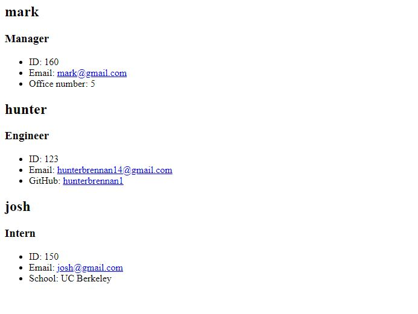

# Team-Profile-Generator

### License
  
***

## Description
This is an application allows the user to create a employee profile for a team including intern,engineer, and manager. This allows the user to easily sort and store data for each employee.
***

## Table of Contents
1. [Technologies Used](#technologies)
2. [Screenshots](#screenshots)
3. [Links](#links)
***

## Technologies Used
  
* HTML

* Bootstrap (CSS)

* JavaScript

* Node.js

* Inquirer

* Jest
***

## Screenshots

***

## Links

[Repo-Link](https://github.com/TottoMoe/PrimaryKeysRentals)
***
